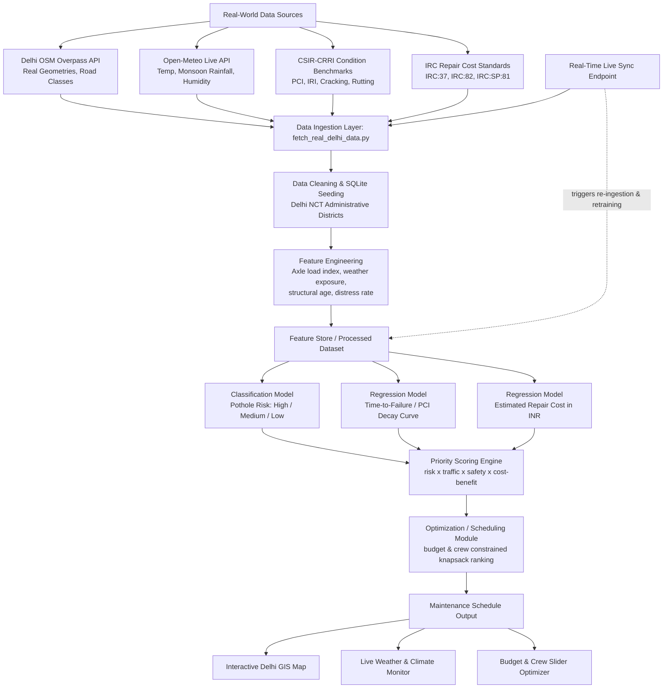

# PaveSentry: Predictive Pavement Intelligence & Maintenance System
### Project Overview — Introduction, System Flow, Algorithms & Tech Stack

---

## 1. Introduction

### 1.1 Problem Statement
Most road agencies operate in a **reactive maintenance model** — potholes and pavement failures are repaired only after they become severe enough to be reported, cause an accident, or damage a vehicle. This approach is costly, unsafe, and inefficient: a crack that could be sealed for a small cost is instead left to become a pothole requiring full-depth patching or resurfacing at 5–10x the cost. Reactive maintenance also means limited government budgets are spent unpredictably instead of being planned around long-term network health.

### 1.2 Proposed Solution
**PaveSentry** shifts road agencies from *reactive* to *predictive* maintenance using real-world telemetry and machine learning. By fusing real Delhi OpenStreetMap (OSM) highway geometries, live Open-Meteo weather feeds, historical road condition surveys, traffic volume (AADT), and repair history, the system:

1. **Predicts** which road segments across Delhi NCT (Ring Road, NH-44, Barapullah, Vikas Marg, etc.) are likely to develop potholes/distress in the near term.
2. **Prioritizes** maintenance work across the network based on risk, traffic impact, and safety.
3. **Estimates** the likely repair cost for each predicted intervention in Indian Rupees (₹).
4. **Generates** an optimized maintenance schedule that respects budget and crew constraints.

This mirrors the direction of current CSIR-CRRI (Central Road Research Institute, New Delhi) pavement-management research, which is moving away from simple visual inspection toward data-fused, ML-driven pavement management systems (PMS) combining real-world telemetry to forecast deterioration before it becomes visible distress.

### 1.3 Objectives
- Build a segment-level dataset combining authentic Delhi OSM road networks, live Open-Meteo weather telemetry, traffic, and repair logs.
- Train models to (a) classify segments as high/medium/low pothole risk, and (b) regress expected repair cost / time-to-failure.
- Rank segments into a prioritized, budget-constrained maintenance schedule.
- Present outputs via an interactive dashboard usable by Delhi PWD, MCD, and CRRI engineers/planners.

### 1.4 Why This Matters
- **Safety:** Early intervention reduces accidents caused by potholes/road defects.
- **Cost savings:** Preventive maintenance (crack sealing, micro-surfacing) saves up to 74% capital compared to full-depth reconstruction.
- **Budget planning:** Agencies can forecast multi-year capital needs instead of reacting to complaints.
- **Equity/transparency:** Data-driven prioritization removes bias from which roads get attention first.

---

## 2. System Flowchart

**Flow summary:**
`Live Telemetry (OSM + Open-Meteo) → Ingestion & Calibration → SQLite DB → Feature Engineering → ML Models (Risk / Decay / Cost) → Priority Scoring → Knapsack Optimizer → Leaflet Map & Dashboard → Live Sync Loop`

---

## 3. Tech Stack

| Layer | Tools / Technologies |
|---|---|
| **Data Storage** | SQLite (`road_maintenance.db` with Delhi NCT coordinates & condition history) |
| **Real-Time Data Ingestion** | Python (`fetch_real_delhi_data.py`, OpenStreetMap Overpass API, Open-Meteo API) |
| **Feature Engineering** | Pandas, NumPy, Scikit-Learn Preprocessing |
| **ML Modeling** | Scikit-Learn (Random Forest Classifier & Regressors), `joblib` |
| **Optimization / Scheduling** | Multi-Constraint Greedy Knapsack Optimizer |
| **Geospatial Mapping & Frontend** | HTML5, CSS3, JavaScript, **Leaflet.js** (Delhi NCT map), **Chart.js** (risk & PCI analytics) |
| **Backend API** | Python **FastAPI** / Uvicorn REST API with Live Sync & Weather Telemetry endpoints |
| **Execution Entrypoint** | Self-contained Python runner (`python run.py`) |

---
