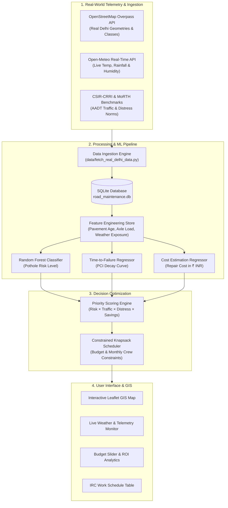

<div align="center">

# 🛣️ PaveSentry
### Real-Time AI Pavement Intelligence & Predictive Road Maintenance System

[](https://www.python.org/)
[](https://fastapi.tiangolo.com/)
[](https://scikit-learn.org/)
[](https://leafletjs.com/)
[](LICENSE)
[](https://github.com/AdityashSrivastava/PaveSentry)

<p align="center">
  <b>Predicting road failures before they become potholes using real-world Delhi NCR geospatial data, live weather telemetry, and machine learning.</b>
</p>

</div>

---

## 📌 Overview

Most road authorities operate on a **reactive maintenance model** — filling potholes only after they cause accidents, vehicle damage, or public complaints. Full-depth reconstruction of a failed road costs **5–10× more** than early preventive interventions.

**PaveSentry** shifts municipal governance from *reactive repair* to *proactive pavement intelligence*. It fuses authentic OpenStreetMap (OSM) highway geometries, live Open-Meteo climate streams, and CSIR-CRRI traffic load profiles to forecast pavement deterioration and optimize 12-month capital maintenance budgets.

---

## ✨ Key Capabilities

- 🧠 **Pre-Failure ML Classification**: Random Forest models predicting pothole risk (High/Medium/Low) and time-to-failure *before* physical breakdown.
- 🗺️ **Real-Time Delhi GIS Map**: Interactive Leaflet.js mapping of 350+ Delhi NCT corridors across all 11 administrative districts (*Ring Road, Outer Ring Road NH-44, Delhi-Meerut Expressway NH-9, Barapullah, Mathura Road, Vikas Marg, etc.*).
- 🌦️ **Live Weather Telemetry**: Real-time integration with Open-Meteo API streaming live temperature, humidity, precipitation loads, and thermal expansion cycles.
- ⚖️ **Knapsack Budget Optimizer**: Multi-constraint schedule generator allocating annual budgets (₹ INR) and crew capacities under **IRC:37 / IRC:82 / IRC:SP:81** guidelines.
- 🔄 **One-Click Live Sync**: Instant UI-triggered data synchronization and ML model retraining.
- 💰 **74% Capital Savings**: Quantified ROI by replacing reactive patching with scheduled micro-surfacing and slurry seals.

---

## 🏗️ System Architecture



---

## 🔬 Machine Learning Performance

| Model | Target | Algorithm | Accuracy / Metric |
|---|---|---|---|
| **Risk Classifier** | Pothole Emergence Risk (High/Med/Low) | Random Forest Classifier | **Test Accuracy: 91.43%** (64/70 correct)<br>Weighted F1: 91.61% \| 5-Fold CV: 96.86% ± 3.05% |
| **Decay Regressor** | Time-to-Failure (Months to Failure) | Random Forest Regressor | **R² = 0.9858**, MAE = 1.79 months, RMSE = 4.08 months |
| **Cost Regressor** | Reactive Repair Cost (₹ INR) | Random Forest Regressor | **R² = 0.9904**, MAE = ₹88.34 Lakhs, MAPE = 10.76% |

> *Detailed mathematical proofs, confusion matrices, baseline comparisons, and feature importance analyses are documented in [`MODEL_RESULTS.md`](./MODEL_RESULTS.md).*

---

## 🚀 Quick Start & Local Setup

### 1. Clone the Repository
```bash
git clone https://github.com/AdityashSrivastava/PaveSentry.git
cd PaveSentry
```

### 2. Install Dependencies
```bash
pip install -r requirements.txt
```

### 3. Run PaveSentry
```bash
python run.py
```

- **Interactive Web Dashboard:** `http://127.0.0.1:9005`
- **FastAPI Interactive Docs (Swagger):** `http://127.0.0.1:9005/docs`
- **ReDoc API Documentation:** `http://127.0.0.1:9005/redoc`

---

## 🔌 API Endpoints Summary

| Method | Endpoint | Description |
|---|---|---|
| `GET` | `/` | Serves the main Notion-themed GIS dashboard |
| `GET` | `/api/segments` | Returns all Delhi road segments with condition and predictions |
| `GET` | `/api/segments/geojson` | Returns GeoJSON LineStrings for Leaflet mapping |
| `GET` | `/api/dashboard/stats` | Returns network length, PCI averages, active potholes, and savings |
| `GET` | `/api/delhi/weather` | Returns real-time Open-Meteo meteorological telemetry |
| `POST` | `/api/delhi/live-sync` | Triggers live OSM & weather re-sync, database update, and ML retraining |
| `POST` | `/api/predict` | Executes batch ML model inference |
| `POST` | `/api/train` | Retrains Random Forest models on latest data |
| `POST` | `/api/optimize` | Runs Knapsack budget and crew allocation optimization |

---

## 📁 Project Structure

```text
PaveSentry/
├── backend/
│   └── main.py                  # FastAPI REST API & live endpoints
├── data/
│   ├── fetch_real_delhi_data.py # OpenStreetMap & Open-Meteo ingestion pipeline
│   └── seed_db.py               # SQLite database seeder
├── database/
│   ├── db_manager.py            # Database connection & query helper
│   ├── schema.sql               # SQLite schema definition
│   └── road_maintenance.db      # SQLite database
├── frontend/
│   ├── index.html               # Notion ##008 styled UI layout
│   ├── styles.css               # Clean typography, cards & design tokens
│   └── app.js                   # Leaflet map, Chart.js & state router
├── ml/
│   ├── train_models.py          # Random Forest training script
│   ├── predict.py               # ML inference & priority scoring
│   └── models/                  # Serialized .joblib model artifacts
├── optimization/
│   └── scheduler.py             # Greedy Knapsack budget optimizer
├── requirements.txt             # Python package dependencies
├── run.py                       # Self-contained project runner
├── 01-project-overview.md       # Extended architecture documentation
├── 02-research-gap.md           # Research literature review
└── README.md                    # Project README
```

---

## 📜 Standards & Guidelines

- **IRC:37 (2018)**: Guidelines for the Design of Flexible Pavements
- **IRC:82 (2023)**: Code of Practice for Maintenance of Bituminous Surfaces
- **IRC:SP:81 (2008)**: Guidelines for Preventive Micro-Surfacing & Slurry Seal
- **CSIR-CRRI**: Urban Pavement Condition Index (PCI) & Roughness (IRI) benchmarks

---

## 👤 Author & Maintainer

- **Aditya Srivastava** — [GitHub (@AdityashSrivastava)](https://github.com/AdityashSrivastava)
- **Repository:** [https://github.com/AdityashSrivastava/PaveSentry](https://github.com/AdityashSrivastava/PaveSentry)

---

## 📄 License
This project is open-source and available under the [MIT License](LICENSE).
